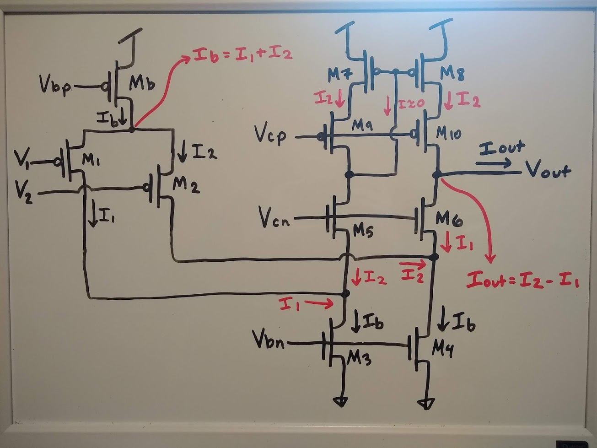

# Miniproject 3: Single-Stage Differential Amplifier
MADVLSI 2021
Vienna Scheyer

## 1. Grok the Circuit
### Which is the inverting input? Which is the non-inverting input? Explain your reasoning briefly
The noninverting input is V1, and the inverting input is V2. I started out by looking at the circuit from the perspective of the currents flowing through it, so that's how I approached this. Figure 1 shows the currents in the circuit based on applying KCL at the node below Mb. KCL at that node says that Ib = I1 + I2, so I used that equation throughout the rest of the circuit to annotate currents. I2 runs through M5, M7, and M9, and then I2 is mirrored over to M8 and it flows through M10 as well. Applying KLC at the node below M6, it is apparent that I1 is flowing M6. Applying KCL again at the node between M10 and M6, we can see that the output current Iout = I2 - I1. 

Based on this understanding of the relationships between the currents in the circuit, we can say that a decrease in I1 means that Vout increases. V1 must increase in order for I1 to decrease. So when V1 increases, Vout also increases. Thus, V1 is the noninverting input.

For the other input, an increase in I2 means that Vout increases. V2 must decrease in order for I2 to increase. So when V2 decreases, Vout increases. This means V2 is the inverting input.

### What is the allowable common-mode input voltage range of this circuit?
The upper bound for the common mode input voltage must allow for the PMOS transistors in the differential pair to be in saturation, which requires a voltage drop of 0.8 or 0.9 V. In this 1.8 V technology, that means that the common mode input voltage should have a maximum of about 0.9 V. On the lower end, the voltage should be high enough to allow for a tenth of a volt across the current source transistor. So the input voltage should be at least 0.1 V. For simulations, I chose voltages of 0.2, 0.34, 0.48, 0.62, and 0.76 V so that the values are evenly spaced within the allowable range.

### If the output voltage were fixed, what would the output current be in terms of I1 and I2?
Iout = I2 - I1 (see section 1 for further explanation).

### Do we need to make the bias current sunk by M3 and M4 equal to the diff-pairbias current,Ib?
### Design a bias circuit for the folded-cascode amplifier that receivesinput from a single current source.
## 2. Schematic Capture and simulation

### Voltage Transfer Characteristics

### Voltage-to-Current Transfer Characteristics

### Loopgain

### Unity-Gain Follower Frequency Response

### Small-Signal Step Response

### Large-Amplitude Step Response

## 3. Layout Design

## 4. Layout Versus Schematic
